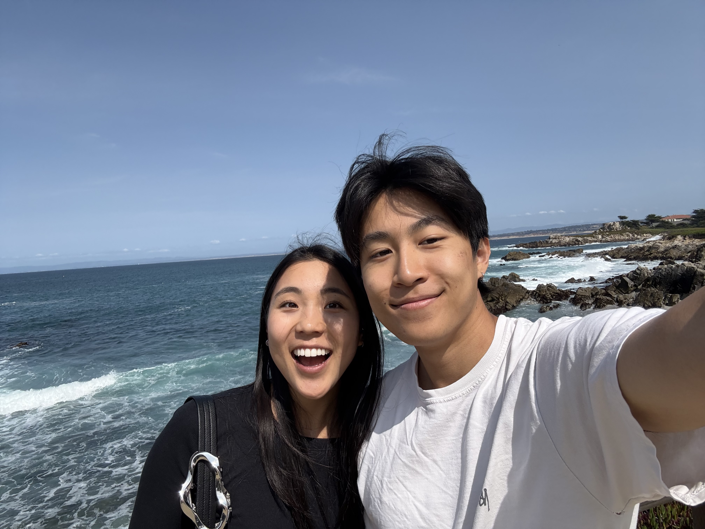

# Hello! My name is Jeremy!

Check out this project's [README](README.md)!

## Section Links

[Pictures](#pictures)

[Introduction](#introduction)

[Hobbies](#hobbies)

[Fav Quote](#favorite-quote)

[Top 3 Restaurants](#top-3-restaurants)

[Favorite Algorithm](#favorite-algorithm-dfs)

[Aspirations](#things-im-currently-working-on)

[Socials](#socials)

## Pictures




## Introduction

I'm a second year CS Major at UCSD from Los Angeles.

## Hobbies

In my free time, I like *skiing*, *baking bread*, and *drinking matcha*!

## Favorite Quote

> The only thing we have to fear is fear itself. -FDR

## Top 3 Restaurants

1 and 3 are in San Diego - **super delicious**

1. Tacos El Gordo
2. Hangari Kalguksu
3. It's Raw Poke

## Favorite Algorithm: DFS

I like DFS because recursion is so cool

```
def dfs(graph,node):
    global visited
    if node not in visited:
        visited.append(node)
        for n in graph[node]:
            dfs(graph,n)
```

## Things I'm currently working on

- [x] Baking my first loaf of sourdough
- [ ] Learning how to hit a rail in snowboarding
- [ ] Getting an A in this class
- [ ] ~~Using less Tiktok~~

### Socials

- [Instagram](https://www.instagram.com/_jeremysu/)
- [LinkedIn](https://www.linkedin.com/in/jeremysu509/)
- [GitHub](https://github.com/jeremysu99)